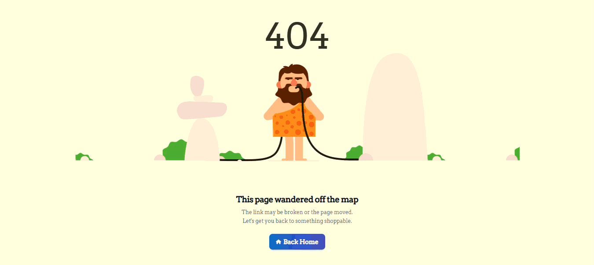

# 404 Not Found Template

A clean and responsive **404 Not Found page template** built with HTML and CSS, featuring a simple animated illustration, modern typography, and a stylish **Back Home** button.

Perfect for websites, portfolios, e-commerce applications, and other web projects that need a custom 404 error page.

## ✨ Features

- 🎯 Clean and modern 404 page design
- 📱 Responsive layout
- 🎨 Custom styling with CSS
- 💨 Tailwind CSS utility classes
- 🅱️ Bootstrap grid system
- 🔤 Google Fonts integration
- 🎞️ Animated 404 illustration
- 🏠 Back to Home button
- ⚡ Lightweight and easy to customize
- 🧩 Easy to integrate into existing projects

## 🚀 Getting Started

### 1. Clone the Repository

```bash
git clone https://github.com/Chamindu-Gayanuka/404-Not-Found-Template.git
```

### 2. Open the Project

Navigate to the project directory:

```bash
cd 404-Not-Found-Template
```

### 3. Run the Template

Simply open `index.html` in your web browser.

No build tools or package installation are required.

## 🎨 Customization

### Change the 404 Message

Edit the content inside `index.html`:

```html
<h1>This page wandered off the map</h1>

<p>
  The link may be broken or the page moved. Let's get you back to something
  shoppable.
</p>
```

### Change the Home URL

Update the `href` attribute of the button:

```html
<a href="/"> Back Home </a>
```

For example:

```html
<a href="/home"> Back Home </a>
```

### Change the Animated Background

The 404 illustration is defined in `style.css`:

```css
.four_zero_four_bg {
  background-image: url("YOUR-IMAGE-URL");
  height: 400px;
  background-position: center;
}
```

Replace the image URL with your preferred 404 animation or illustration.

### Change the 404 Number Style

Modify the following CSS:

```css
.four_zero_four_bg h1 {
  font-size: 80px;
}
```

## 📸 Preview

<p align="center">
  
</p>

## 📄 License

This project is provided for learning, personal projects, and customization.

Please review the [licenses](https://github.com/Chamindu-Gayanuka/404-Not-Found-Template/blob/main/LICENSE) and usage terms of any third-party resources used in the template before using them in commercial projects.

## 👨‍💻 Author

**Chamindu Gayanuka Dharmasiri**

- GitHub: [Chamindu-Gayanuka](https://github.com/Chamindu-Gayanuka)

---

⭐ If you find this template useful, consider giving the repository a star!
